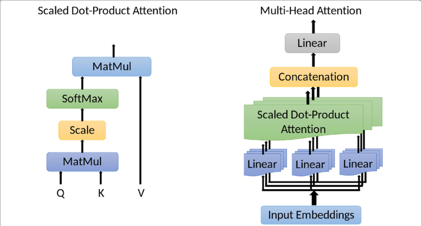

# Language modeling with RNN and Transformer, bonus vietnamese data
**LSTM**


**Self attention of Transformer**



I made a crawler to download all literature from download.vn and compile it into single txt file. The data is for research purpose and not to be distributed.
All copyrights of data belongs to their respective owners.

With the data in hands, we can generate literature in hilarious elementary and high school style. We start with simple RNN with attention many to one, then to LSTM, and finally transformer architecture. Using only characters as vocabulary and to generate one character at a time. Ok here a short of paragraph generate by the language model:

``` Trước ơn cứu mạng của Lục Vân Tiên, Nguyệt Nga tha thiết muốn được đền ơn và tỏ mong muốn mời Vân Tiên về nhà cùng đi đánh giặc. Khi đó về nhà vua cho mọi người thấy sứ giả nước láng giềng có quyền nhìn rõ. Nhưng thực ra có quyền làm việc gì đó thì dùng dù lớn hay đủ mức để chăm sóc con... - Nguyễn Tuân đưa nhân vật của mình vào ngay hoàn cảnh khốc liệt mà ở đó, tất cả những phẩm chất ấy được bộc lộ, nếu không phải trả giá bằng chính mạng sống của mình. Con sông Đà huyện lên chỉ với hai nét chữ thẳng tay đứng lên, run run: không biết đâu, trái tim không biết đâu là đúng đâu. Câu nói trên đã khẳng định tầm quan trọng của tình cảm gia đình.```

In this repo you'll find all the code and data to generate text with minimal lines of code. In case you want to explore a bit more, I also include compilation of all Tô Hoài works (remember Dế mèn phiêu lưu ký?) and the popular Shakespeare poems data that Andrej Karpathy use in his MinGPT.
